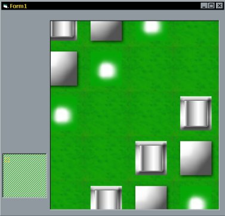



## Smooth Scroll Tile Engine

### Description

This quite complecated code is very cool if you are into tile engines.A tile engine is a piece of code that draws tiled pictures. My code lets you scroll smooothly though the game level and hopefully advanced users can use this code for their own games and things. One more thing, This code is VERY VERY VERY fast. about 8 lines to use in your inner loops and it's not even optimized.

Try It!
 
### More Info
 

             |
---                |---
**Submitted On**   |2000-05-25 21:56:18
**By**             |[Michael Pote](https://github.com/Planet-Source-Code/PSCIndex/blob/master/ByAuthor/michael-pote.md)
**Level**          |Advanced
**User Rating**    |4.0 (12 globes from 3 users)
**Compatibility**  |VB 4\.0 \(32\-bit\), VB 5\.0, VB 6\.0
**Category**       |[Custom Controls/ Forms/  Menus](https://github.com/Planet-Source-Code/PSCIndex/blob/master/ByCategory/custom-controls-forms-menus__1-4.md)
**World**          |[Visual Basic](https://github.com/Planet-Source-Code/PSCIndex/blob/master/ByWorld/visual-basic.md)
**Archive File**   |[CODE\_UPLOAD60985252000\.zip](https://github.com/Planet-Source-Code/michael-pote-smooth-scroll-tile-engine__1-8355/archive/master.zip)

